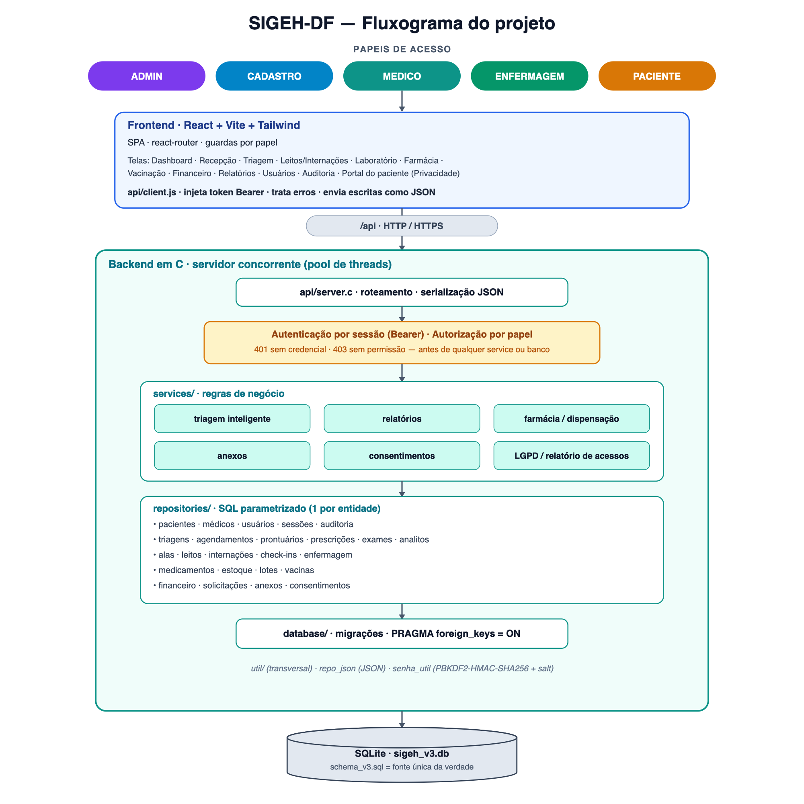
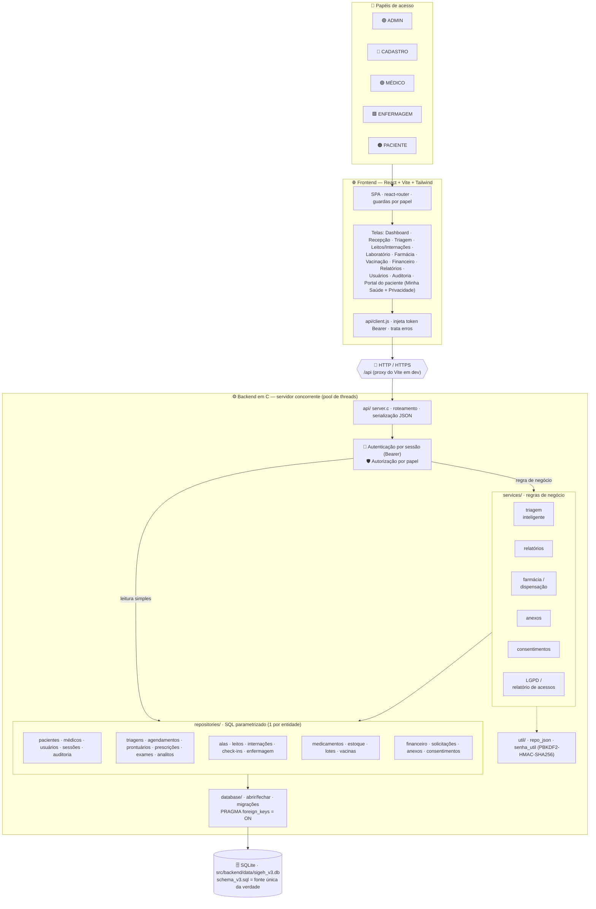

<div align="center">

# 🏥 SIGEH-DF

### Sistema Integrado de Gestão Hospitalar

Projeto acadêmico em **C** que evoluiu de um sistema de terminal em memória para um **backend web full-stack** com banco SQLite, arquitetura em camadas, triagem inteligente, API HTTP e autenticação por papéis.


</div>

---

## 📑 Sumário

- [Visão geral](#-visão-geral)
- [Destaques](#-destaques)
- [Fluxograma do projeto](#-fluxograma-do-projeto)
- [Arquitetura](#-arquitetura)
  - [Ciclo de vida de uma requisição](#ciclo-de-vida-de-uma-requisição)
  - [Convenções de projeto](#convenções-de-projeto)
- [Estrutura de pastas](#-estrutura-de-pastas)
- [Pré-requisitos](#-pré-requisitos)
- [Instalação e build](#-instalação-e-build)
  - [Alvos do Makefile](#alvos-do-makefile)
- [Testes](#-testes)
- [Autenticação](#-autenticação)
- [Autorização e papéis](#-autorização-e-papéis)
- [Referência da API](#-referência-da-api)
- [Walkthrough completo](#-walkthrough-completo)
- [Triagem inteligente](#-triagem-inteligente)
- [Modelo de domínio](#-modelo-de-domínio)
- [Códigos HTTP](#-códigos-http)
- [Como estender o projeto](#-como-estender-o-projeto)
- [Segurança](#-segurança)
- [Evolução por etapas](#-evolução-por-etapas-v3)
- [Notas acadêmicas](#-notas-acadêmicas)

---

## 🎯 Visão geral

O **SIGEH-DF** (Sistema Integrado de Gestão Hospitalar) simula, de forma modular e didática, o funcionamento de um ambiente hospitalar. Ele cobre o ciclo de atendimento — do cadastro do paciente à triagem, agendamento, atendimento, exames, internação e indicadores gerenciais.

O projeto nasceu como uma aplicação de **terminal** (linha de comando, dados em memória) e foi reorganizado para um **backend web** em camadas, sem abandonar a simplicidade do C básico. A persistência é feita em **SQLite**; a comunicação, via **API HTTP** que responde em JSON.

O grande diferencial é a **triagem inteligente**: ela deixou de ser apenas uma classificação de risco e virou o **primeiro motor de decisão** do sistema. A partir de uma triagem, o sistema:

1. calcula **risco, prioridade e especialidade provável**;
2. consulta o **histórico clínico** (prontuários e exames anteriores);
3. **sugere exames iniciais** conforme o quadro;
4. encontra **médicos disponíveis** por especialidade e região;
5. **agenda ou encaminha** o paciente automaticamente.

---

## ✨ Destaques

- 🧠 **Triagem inteligente** como motor de decisão (avaliação, histórico, sugestão de exames, agendamento e encaminhamento automáticos).
- 🧱 **Arquitetura em camadas** clara: `database → repositories → services → api`.
- 🔒 **Segurança de dados**: prepared statements em toda entrada, integridade referencial no banco (FK), senhas com **hash PBKDF2-HMAC-SHA256 + salt**.
- 👥 **Login por papéis** criado pelo administrador: `ADMIN`, `CADASTRO`, `MEDICO`, `ENFERMAGEM`, `PACIENTE`.
- 🔑 **Sessão por token** (Bearer): credenciais só no corpo do login, bloqueio por tentativas e troca de senha (obrigatória no 1º acesso).
- 🌐 **API REST** em C puro com sockets POSIX (sem framework), **servidor concorrente** (pool de threads) e escritas via **corpo JSON**.
- ✅ **29 suítes de teste C** automatizadas com `assert.h`, **39 testes frontend** (8 arquivos) com Vitest, além de smoke HTTP, integração e smoke TLS.
- ♻️ **Banco reconstruível e versionado**: o schema é a fonte da verdade, o `.db` é descartável e **migrações** atualizam bancos antigos sem perder dados.

---

## 🧬 Origem do projeto

O SIGEH-DF nasceu como uma aplicação de **terminal** (CLI em C, dados em memória) e evoluiu para o **backend web em camadas** ([`src/backend/web/`](src/backend/web/)) que é o foco atual. A versão de terminal cumpriu seu papel como protótipo e foi descontinuada — seu histórico permanece preservado no repositório git, mas o código não faz mais parte da árvore do projeto.

A persistência ficou desde o início em **SQLite**, com o schema versionado em [`src/backend/data/schema_v3.sql`](src/backend/data/schema_v3.sql) como fonte única da verdade.

---

## 🗺️ Fluxograma do projeto

Visão de ponta a ponta: do papel que acessa o sistema, passando pelo frontend e
pela rede, até as camadas do backend e o banco. Cada papel só enxerga o que sua
política de acesso permite; toda escrita trafega como **corpo JSON** e toda
leitura/escrita no banco usa **prepared statements**.



<details>
<summary>📐 Ver o mesmo diagrama em Mermaid (renderiza no GitHub)</summary>



</details>

> [!NOTE]
> O caminho `Atores → Frontend → /api → API` passa **obrigatoriamente** pelo
> portão de autenticação e autorização: falha de credencial responde `401` e
> falta de permissão responde `403` — **antes** de qualquer service ou banco.

---

## 🏗️ Arquitetura

O backend web segue uma arquitetura em camadas, de baixo para cima. Cada camada só conhece a camada imediatamente inferior.

```text
┌───────────────────────────────────────────────────────────────┐
│  api/          Servidor HTTP (sockets POSIX), roteamento,       │
│                sessão por token (Bearer) e autorização por papel │
├───────────────────────────────────────────────────────────────┤
│  services/     Regras de negócio: triagem, relatórios, farmácia,  │
│                anexos, consentimentos e LGPD.                     │
├───────────────────────────────────────────────────────────────┤
│  repositories/ Acesso a dados — 1 arquivo por entidade.          │
│                Só SQL, com prepared statements. "Burros".        │
├───────────────────────────────────────────────────────────────┤
│  database/     Camada fina sobre o SQLite: abrir/fechar,         │
│                executar SQL, resetar a partir do schema.         │
├───────────────────────────────────────────────────────────────┤
│  SQLite (src/backend/data/sigeh_v3.db)                               │
└───────────────────────────────────────────────────────────────┘
```

**Responsabilidades:**

- **`database/`** — encapsula o `sqlite3`: gerencia o caminho do banco, abre conexões (com `PRAGMA foreign_keys = ON`), executa scripts e recria o banco a partir do schema. Não conhece nenhuma entidade.
- **`repositories/`** — um por entidade. Convertem chamadas em SQL parametrizado (`prepare → bind → step → finalize`). Não contêm regra de negócio.
- **`services/`** — regras que cruzam entidades ou exigem validação própria: triagem inteligente, relatórios, dispensação farmacêutica, anexos, consentimentos e relatório LGPD.
- **`api/`** — recebe a requisição HTTP, autentica, aplica a política de acesso e despacha para o handler, que chama um service ou repository e serializa a resposta em JSON.
- **`util/`** — utilitários transversais sem regra de negócio: `repo_json` (montagem/escape de JSON) e `senha_util` (hash de senha com PBKDF2-HMAC-SHA256 + salt via OpenSSL).

### Ciclo de vida de uma requisição

```text
Cliente HTTP
   │  GET /triagens/1/avaliacao   (Authorization: Bearer …)
   ▼
[ api ] aceita a conexão, lê a requisição
   │
   ├─▶ /health?  → responde direto (rota pública)
   │
   ├─▶ autentica (token Bearer) ── falhou ─▶ 401 Unauthorized
   │
   ├─▶ autorizado(método, rota, papel)? ── não ─▶ 403 Forbidden
   │
   ▼
[ service ] triagem_service_avaliar_json(...)
   │
   ▼
[ repository ] triagem_repo_ultima_por_paciente(...)
   │
   ▼
[ database ] db_abrir() → SQLite → db_fechar()
   │
   ▼
JSON de volta ao cliente (200 / 4xx / 5xx)
```

### Convenções de projeto

| Convenção | Regra |
|---|---|
| **Retorno de escrita** | `1` = sucesso · `0` = falha |
| **Contagens** | retornam o número, ou `-1` em erro |
| **Listagens** | preenchem um buffer com **JSON** e retornam `1`/`0` |
| **SQL** | sempre `sqlite3_prepare_v2` + `bind` (nunca `sprintf` com dados do usuário) |
| **Exclusão** | dados clínicos/cadastrais usam estado lógico ou status; sessões, anexos e vínculos auxiliares podem ter remoção física controlada |
| **Nomes** | identificadores e mensagens em português, sem acento no código |
| **Estilo** | chaves em linha própria (Allman), 4 espaços, funções curtas |

---

## 📁 Estrutura de pastas

```text
Gestao_Saude/
├── README.md
├── manual.md                         # instalação, execução e validação
├── docs/                             # arquitetura e validação técnica
├── imagens/                          # imagens da documentação
├── executavel/                       # binário e frontend de distribuição
└── src/
    ├── frontend/                     # React, Vite, Tailwind e Vitest
    │   ├── src/
    │   │   ├── api/                  # cliente HTTP
    │   │   ├── auth/                 # sessão e identidade
    │   │   ├── components/           # componentes reutilizáveis
    │   │   └── pages/                # telas por fluxo hospitalar
    │   ├── package.json
    │   └── vite.config.js
    └── backend/
        ├── data/
        │   ├── schema_v3.sql         # schema v16, fonte da verdade
        │   ├── sigeh_v3.db           # banco gerado, ignorado pelo git
        └── web/
            ├── Makefile              # build e testes específicos do backend
            ├── api/server.c          # HTTP/HTTPS, SPA, auth e rotas
            ├── database/             # SQLite e migrações
            ├── repositories/         # 23 módulos de acesso a dados
            ├── services/             # regras de negócio
            ├── util/                 # utilitários transversais
            ├── tools/seed.c          # carga de dados de exemplo
            └── tests/                # testes C e HTTP/HTTPS
```

---

## ⚙️ Pré-requisitos

| Ferramenta | Uso |
|---|---|
| **GCC** ou **clang** | compilação (C padrão) |
| **make** | orquestração de build/test |
| **SQLite 3** (`-lsqlite3`) | banco de dados |
| **OpenSSL** (`libcrypto`) | hash de senhas (PBKDF2-HMAC-SHA256) |
| **OpenSSL** (`libssl`) | transporte TLS/HTTPS opcional |
| **Node.js + npm** | desenvolvimento, teste e build do frontend |
| **curl** | smoke, integração e testes manuais da API |

> 💡 **OpenSSL no macOS (Homebrew)** costuma ficar em `/opt/homebrew/opt/openssl@3`, que **não** está no path padrão do compilador. O `Makefile` já aponta para lá via `OPENSSL_DIR`. Em outro caminho (ex.: Linux), basta sobrescrever:
> ```sh
> make OPENSSL_DIR=/usr
> ```

---

## 🚀 Instalação e build

Consulte também o [`manual.md`](manual.md).

### Backend web

```sh
cd src/backend/web
make            # compila a camada de banco e o servidor da API
make seed       # recria e popula o banco com dados de exemplo
make run        # sobe o servidor HTTP na porta 8080
```

Ao subir, o servidor imprime `SIGEH-DF API ouvindo em http://localhost:8080` e **fica aguardando requisições** (é um servidor — não tem tela própria). Para interagir, use `curl` ou um navegador em outro terminal. Para encerrar, `Ctrl+C`.

```sh
curl -i http://localhost:8080/health           # rota pública
# login -> token, depois use o token nas rotas autenticadas
TOKEN=$(curl -s -X POST http://localhost:8080/sessao \
  -H 'Content-Type: application/json' \
  -d '{"login":"admin","senha":"admin123"}' \
  | sed -n 's/.*"token":"\([0-9a-f]*\)".*/\1/p')
curl -H "Authorization: Bearer $TOKEN" http://localhost:8080/me
```

> ⚠️ O servidor abre o banco em `../data/sigeh_v3.db` por **caminho relativo** — execute sempre **de dentro de `src/backend/web/`**.

### Alvos do Makefile

| Alvo | O que faz |
|---|---|
| `make` / `make all` | Compila `build/database.o` e o servidor `build/sigeh_api` |
| `make api` | Compila apenas o servidor da API |
| `make seed` | Recria o banco oficial e insere os dados de exemplo |
| `make db-reset` | Alias de `make seed` |
| `make run` | Compila e sobe o servidor (HTTP) na porta 8080 |
| `make cert` | Gera um certificado TLS autoassinado de desenvolvimento em `certs/` |
| `make run-tls` | Sobe o servidor em **HTTPS** na porta 8443 (gera o cert se preciso) |
| `make frontend` | Builda o frontend (Vite) e publica em `public/` para o servidor servir |
| `make test` | Compila e roda as 29 suítes de teste C |
| `make test_<nome>` | Roda uma suíte específica (ex.: `make test_triagem_service`) |
| `make api-smoke-test` | Executa `tests/api_smoke_test.sh` (liveness, auth e escopo por papel via `curl`) |
| `make api-integration-test` | Executa `tests/api_integration_test.sh` (fluxos ponta a ponta encadeados) |
| `make api-tls-smoke-test` | Executa `tests/api_tls_smoke_test.sh` (health/login/rota autenticada sobre HTTPS) |
| `make clean` | Remove o diretório `build/` (binários, objetos e banco de teste) |

> Todos os artefatos compilados vão para `src/backend/web/build/` (binários, `database.o` e o banco de teste), mantido fora do versionamento.

### Produção (full-stack num binário só)

Em produção o **próprio servidor em C serve o frontend buildado** e a API na mesma origem — não precisa de Vite nem de CORS:

```sh
cd src/backend/web
make frontend     # builda o React e copia o resultado para public/
make run          # sobe o servidor; abra http://localhost:8080
```

O servidor entrega `public/index.html` e os assets para qualquer rota que **não** seja da API (`/`, `/login`, `/r/...`, com fallback de SPA para o `index.html`), e mantém a API na raiz (`/pacientes`, `/relatorios/...`, etc.). No modo de **desenvolvimento** (`npm run dev`), o front fala com a API via proxy `/api`; no build de produção ele chama a raiz automaticamente.

### Desenvolvimento do frontend

```sh
cd src/frontend
npm install
npm run dev      # Vite com proxy /api para localhost:8080
npm test         # 39 testes (8 arquivos) com Vitest
npm run lint     # ESLint
npm run build    # gera dist/
```

O frontend possui navegação e guardas por papel, além das telas de recepção, triagem, internações/leitos, laboratório, farmácia/estoque, vacinação, financeiro, relatórios, usuários, auditoria e portal do paciente (incluindo a aba **Privacidade**: carteira de consentimentos LGPD com revogação e relatório de quem acessou os próprios dados). A autorização efetiva continua no backend; ocultar uma opção na interface não substitui a resposta `403`.

---

## 🧪 Testes

```sh
cd src/backend/web
make test
```

São **29 suítes C** com `assert.h`. Elas usam bancos de teste dentro de `build/`, recriados a partir do schema conforme a necessidade de cada módulo, sem depender do banco oficial.

| Camada | Suítes |
|---|---|
| **Repositories** | paciente · medico · ala · leito · triagem · agendamento · prontuario · exame · internacao · usuario · prescricao · auditoria · enfermagem · checkin · financeiro · sessao · lote · analito · solicitacao · medicamento · estoque · vacina · anexo · consentimento |
| **Services** | triagem_service · relatorio_service |
| **Infra** | credencial_util · migracoes |

**Detalhes relevantes:**

- Como o banco roda com **chaves estrangeiras ativas**, os testes **semeiam os registros-pai** antes dos filhos (ex.: criam a ala antes do leito, o paciente antes da triagem).
- O `triagem_service` é testado de ponta a ponta: avaliação, especialidades/problemas clínicos, múltiplas suspeitas, sugestão de médicos, histórico, sugestão de exames, agendamento (incluindo conflito de horário) e encaminhamento.
- O `usuario_repository` valida criação, login único, autenticação correta/incorreta e — importante — que a **listagem nunca expõe senha/hash/salt**.
- `sessao` cobre token de sessão, bloqueio por tentativas e troca de senha; `migracoes` valida a atualização de um banco antigo (preservando dados) e a idempotência.

Para validar a API em execução há três verificações: **smoke HTTP** (liveness, auth, papéis e módulos), **integração** (fluxos ponta a ponta encadeados) e **smoke TLS**:

```sh
make api-smoke-test
make api-integration-test
make api-tls-smoke-test
```

O frontend também possui testes automatizados:

```sh
cd src/frontend
npm test
npm run lint
```

---

## 🔐 Autenticação

A API usa **sessão por token (Bearer)**. O login é um `POST /sessao` que recebe
`{login, senha}` **no corpo** (a senha nunca vai na URL); em caso de sucesso o
servidor cria uma sessão (token opaco, validade de 8h) e devolve o token. As
demais requisições enviam `Authorization: Bearer <token>`; `DELETE /sessao`
encerra a sessão.

**Endurecimento de acesso:**

- **Bloqueio por tentativas**: após 5 senhas erradas o login fica bloqueado por 15 minutos (`429`).
- **Proteção por IP**: 10 falhas dentro de uma janela de 15 minutos bloqueiam temporariamente novas tentativas daquele IP por 15 minutos; o evento também é auditado.
- **Troca de senha** (`POST /me/senha`) e **troca obrigatória no 1º acesso**: contas criadas pelo administrador nascem exigindo nova senha antes de usar o sistema.
- **Sessão deslizante**: o token vale por 8 horas e é renovado em `GET /me` enquanto ainda estiver válido.

**Como as senhas são guardadas** (nunca em texto puro):

```text
cadastro:   senha ─▶ salt aleatório ─▶ PBKDF2(salt, senha, 210k) ─▶ guarda (salt, hash)
login:      senha + salt guardado ─▶ PBKDF2 ─▶ compara com o hash guardado
```

O hashing usa **OpenSSL (PBKDF2-HMAC-SHA256)** com salt por usuário. Os **logins são criados pelo administrador** (`POST /usuarios`), nunca por auto-cadastro.

```sh
# login: credenciais no corpo JSON -> recebe o token
TOKEN=$(curl -s -X POST http://localhost:8080/sessao \
  -H 'Content-Type: application/json' \
  -d '{"login":"admin","senha":"admin123"}' \
  | sed -n 's/.*"token":"\([0-9a-f]*\)".*/\1/p')

# requisições autenticadas usam o token
curl -H "Authorization: Bearer $TOKEN" http://localhost:8080/me
# -> {"papel":"ADMIN","pacienteId":0,"medicoId":0,"trocarSenha":false}
```

---

## 👥 Autorização e papéis

Toda rota exige autenticação, **exceto** `GET /health` e `POST /sessao`. A política de acesso é **centralizada** numa única função (`autorizado(método, rota, papel)`) aplicada no topo do roteador — fácil de auditar e alterar.

| Papel | Permissões |
|---|---|
| **ADMIN** | Acesso administrativo total, incluindo o cadastro de usuários (`/usuarios`); ações clínicas seguem auditadas. |
| **CADASTRO** | Cadastros, recepção, financeiro, laboratório administrativo, anexos e registro/leitura de consentimentos; não acessa o relatório clínico LGPD. |
| **MEDICO** | Leitura dos cadastros **+** todo o clínico (triagens, agendamentos, prontuários, exames, internações, triagem inteligente, relatórios) **+** suas rotas `/me`. Nas listas amplas, vê **apenas os próprios dados** (escopo por identidade — veja abaixo). |
| **ENFERMAGEM** | Triagem, fila, leitos, transferências, medicação, farmácia, estoque, vacinação e leitura dos dados necessários ao cuidado. |
| **PACIENTE** | Apenas dados e ações próprias via `/me`: consultas, exames, receitas, prontuários, vacinas, cobranças, solicitações e privacidade. **Paciente não cria, edita nem reclassifica triagem.** |

### Matriz de acesso (resumo)

| Grupo de rotas | ADMIN | CADASTRO | MEDICO | ENFERMAGEM | PACIENTE |
|---|:---:|:---:|:---:|:---:|:---:|
| `/usuarios` | ✅ | ❌ | ❌ | ❌ | ❌ |
| Cadastros — leitura (`GET`) | ✅ | ✅ | ✅ | ❌ | ❌ |
| Cadastros — escrita (`POST`/`DELETE`) | ✅ | ✅ | ❌ | ❌ | ❌ |
| Clínico (triagens, agend., pront., exames) | ✅ | ❌ | ✅ | parcial | ❌ |
| Internações/leitos/alas — leitura | ✅ | ✅ | ✅ | ✅ | ❌ |
| Triagem clínica guiada | ✅ | ❌ | ✅ | ✅ | ❌ |
| Recepção/check-in | ✅ | ✅ | operacional | operacional | ❌ |
| Farmácia, estoque e vacinação | ✅ | ❌ | ❌ | ✅ | próprios via `/me` |
| Financeiro | ✅ | ✅ | ❌ | ❌ | próprio via `/me` |
| Laboratório estruturado | ✅ | ✅ | ✅ | leitura | resultados próprios |
| Anexos clínicos/cadastrais | ✅ | ✅ | ✅ | ✅ | ❌ |
| Relatórios | ✅ | ❌ | ✅ | ❌ | ❌ |
| Consentimentos — leitura administrativa | ✅ | ✅ | ✅ | ✅ | ❌ |
| Consentimentos — criar / revogar | ✅ | criar | ❌ | ❌ | próprios via `/me` |
| Relatório LGPD de acessos | ✅ | ❌ | ✅ | ✅ | próprio via `/me` |
| `/me` e `/me/...` | ✅ | ✅ | ✅ | ✅ | ✅ |

<sub>\* CADASTRO acessa alas/leitos como parte dos cadastros; internações são clínicas.</sub>

#### Escopo de dados por identidade (MEDICO)

Além da autorização por papel, as **listagens amplas são filtradas pela identidade** quando quem chama é um `MEDICO`: a mesma URL devolve só os dados dele.

| Rota | ADMIN / CADASTRO | MEDICO |
|---|---|---|
| `GET /pacientes` | todos | apenas pacientes com agendamento com o médico |
| `GET /agendamentos` | todos | apenas a própria agenda |
| `GET /prontuarios` | todos | apenas os prontuários que ele assinou |
| `GET /exames` | todos | apenas os exames que ele solicitou |
| `GET /prescricoes` | todas | apenas as que ele prescreveu (ENFERMAGEM vê todas as ativas) |
| `GET /triagens` | todas | apenas as triagens cuja especialidade provável (pelo `tipo`) é a dele |

As contagens `/.../contar` permanecem **globais** (indicadores do sistema); para os totais do próprio médico há o endpoint dedicado **`GET /me/resumo`**. As demais rotas `/me/...` seguem como o caminho explícito do "só o seu".

Respostas: **`401`** sem credencial válida · **`403`** papel sem permissão.

---

## 🌐 Referência da API

> Todas as rotas exigem autenticação (token Bearer), **exceto** `GET /health` e `POST /sessao`. Os parâmetros de escrita (`POST`/`DELETE`) vão no **corpo JSON**.

### Saúde e sessão

| Método | Rota | Papel | Descrição |
|---|---|---|---|
| `GET` | `/health` | público | Status do serviço e do banco |
| `POST` | `/sessao` | público | Login: `{login, senha}` no corpo → token de sessão |
| `DELETE` | `/sessao` | autenticado | Encerra a sessão atual |
| `GET` | `/me` | autenticado | Papel e vínculos do usuário logado (e `trocarSenha`) |
| `POST` | `/me/senha` | autenticado | Troca a senha: `{senha_atual, senha_nova}` |
| `GET` | `/me/exames` | PACIENTE | Exames do próprio paciente |
| `GET` | `/me/exames/{id}/resultados` | PACIENTE | Resultados estruturados de exame próprio |
| `GET` | `/me/prontuarios` | PACIENTE | Prontuários do próprio paciente |
| `GET` | `/me/perfil` | PACIENTE | Cadastro e carteirinha do próprio paciente |
| `GET` | `/me/agendamentos` | PACIENTE | Consultas próprias com dados do médico |
| `GET` | `/me/agendamentos/especialidades` | PACIENTE | Especialidades disponíveis para autoagendamento |
| `GET` | `/me/agendamentos/disponibilidade` | PACIENTE | Horários livres por especialidade e data |
| `POST` | `/me/agendamentos` | PACIENTE | Confirma uma consulta própria em horário disponível |
| `GET` | `/me/cobrancas` | PACIENTE | Cobranças do próprio paciente |
| `GET` | `/me/agenda` | MEDICO | Agenda do próprio médico |
| `GET` | `/me/pacientes` | MEDICO | Pacientes do próprio médico |
| `GET` | `/me/receitas` | PACIENTE | Prescrições do próprio paciente |
| `GET` | `/me/consentimentos` | PACIENTE | Histórico dos próprios consentimentos, incluindo os revogados |
| `POST` | `/me/consentimentos/{id}/revogar` | PACIENTE | Revoga consentimento próprio; exige `{motivo}` |
| `GET` | `/me/relatorio-acessos` | PACIENTE | Relatório de quem acessou os próprios dados |
| `GET` | `/me/solicitacoes` | PACIENTE | Solicitações administrativas próprias (`AGENDAMENTO`, `AJUDA`) |
| `POST` | `/me/solicitacoes` | PACIENTE | Cria solicitação administrativa: `{tipo, mensagem}` |
| `GET` | `/me/resumo` | MEDICO | Totais do próprio médico: pacientes, agendamentos, prontuários e exames |

### Recepção e check-in

O check-in confirma a chegada, gera uma senha e encaminha para `TRIAGEM` ou `CONSULTA`. O histórico não é apagado; a fila evolui por transições de estado auditadas.

| Método | Rota | Descrição |
|---|---|---|
| `GET` | `/checkins` · `/checkins/contar` | Lista a fila e conta pacientes aguardando |
| `POST` | `/checkins` | Cria check-in: `{paciente_id, destino}` |
| `POST` | `/checkins/{id}/chamar` | Move de `AGUARDANDO` para `EM_ATENDIMENTO` |
| `POST` | `/checkins/{id}/rechamar` | Incrementa a quantidade de rechamadas |
| `POST` | `/checkins/{id}/faltar` | Marca ausência |
| `POST` | `/checkins/{id}/retornar` | Retorna uma falta para a fila |
| `POST` | `/checkins/{id}/encerrar` | Encerra o atendimento |
| `POST` | `/checkins/{id}/cancelar` | Cancela com `{motivo}` obrigatório |

### Solicitações do paciente

| Método | Rota | Papel | Descrição |
|---|---|---|---|
| `GET` | `/solicitacoes-paciente` · `/solicitacoes-paciente/contar` | ADMIN, CADASTRO, MEDICO, ENFERMAGEM | Fila operacional de pedidos do portal |
| `POST` | `/me/solicitacoes` | PACIENTE | Solicita consulta comum ou ajuda. Não cria triagem, não define risco e não toma decisão clínica |

### Usuários · ADMIN

| Método | Rota | Parâmetros |
|---|---|---|
| `GET` | `/usuarios` · `/usuarios/contar` | — |
| `POST` | `/usuarios` | `nome`, `login`, `senha`, `papel`, `paciente_id`, `medico_id` |
| `DELETE` | `/usuarios/{id}` | Desativa logicamente |
| `POST` | `/usuarios/{id}/reativar` | Reativa um usuário desativado |
| `POST` | `/usuarios/{id}/senha` | Define senha temporária `{senha_nova}`, desbloqueia e exige troca no próximo acesso |
| `GET` | `/auditoria` · `/auditoria/contar` | Consulta a trilha geral e sua contagem |

### Cadastros · ADMIN, CADASTRO (MEDICO só leitura)

Disponível para `pacientes`, `medicos`, `alas`, `leitos`:

| Método | Rota | Parâmetros de criação (exemplos) |
|---|---|---|
| `GET` | `/{entidade}` · `/{entidade}/contar` | — |
| `POST` | `/{entidade}` | `pacientes`: `nome,nascimento,documento,tipo_documento,telefone,sexo,regiao,responsavel,alergias` · `medicos`: `nome,crm,especialidade,regiao` · `alas`: `nome,tipo,total_leitos` · `leitos`: `ala_id,numero` |
| `DELETE` | `/{entidade}/{id}` | exclusão lógica |

Rotas complementares de paciente:

| Método | Rota | Descrição |
|---|---|---|
| `GET` | `/pacientes/buscar?q=...` | Busca operacional por nome/documento |
| `GET` | `/pacientes/{id}` | Detalhe cadastral |
| `GET` | `/pacientes/{id}/historico` | Histórico clínico agregado |
| `POST` | `/pacientes/{id}/contato` | Atualiza `{telefone}` |
| `POST` | `/pacientes/{id}/convenio` | Define `{convenio_id}`; zero representa particular |
| `GET` | `/pacientes/{id}/evolucoes` | Lista evoluções de enfermagem |
| `POST` | `/pacientes/{id}/evolucao` | Registra nota e sinais vitais |
| `GET` | `/pacientes/{id}/administracoes` | Lista administrações de medicamentos |

### Clínico, internações e leitos

Disponível para `triagens`, `agendamentos`, `prontuarios`, `exames`, `internacoes`:

| Método | Rota | Observação |
|---|---|---|
| `GET` | `/{entidade}` · `/{entidade}/contar` | listar / contar |
| `POST` | `/{entidade}` | criar (parâmetros conforme a entidade) |
| `DELETE` | `/agendamentos/{id}` | Cancela com `{motivo}` |
| `POST` | `/agendamentos/{id}/reagendar` | Reagenda com `{data, horario}`, respeitando grade e conflito |
| `POST` | `/prontuarios/{id}/retificar` | Cria nova versão com justificativa; o original é preservado |
| `POST` | `/internacoes/{id}/alta` | Alta com `data`, resumo, diagnóstico e orientações |
| `POST` | `/internacoes/{id}/transferir` | Transfere para outro leito e registra responsável |
| `GET` | `/leitos/ocupacao` | Totais por estado de leito |
| `POST` | `/leitos/{id}/status` | Altera estado operacional do leito |
| `DELETE` | `/triagens/{id}` | Desativa logicamente uma triagem |

Prontuários não possuem rota de remoção. Exames concluídos e prontuários são corrigidos por retificação versionada, preservando as versões anteriores.

### Prescrições / medicação · ADMIN, MEDICO (ENFERMAGEM lê, PACIENTE vê as suas)

| Método | Rota | Observação |
|---|---|---|
| `GET` | `/prescricoes` · `/prescricoes/contar` | MEDICO vê só as suas; ENFERMAGEM e ADMIN veem todas as ativas |
| `POST` | `/prescricoes` | `paciente_id`, `medico_id`, `medicamento`, `dosagem`, `frequencia`, `observacoes` |
| `POST` | `/prescricoes/{id}/administrar` | ENFERMAGEM registra a administração e observação |
| `DELETE` | `/prescricoes/{id}` | Suspende a prescrição; exige `{motivo}` |
| `GET` | `/me/receitas` | PACIENTE — as próprias prescrições |

### LGPD: consentimentos e relatório de acesso

Os consentimentos são registros históricos vinculados ao paciente e a uma finalidade específica. A criação exige `paciente_id`, `finalidade` e `versao_termo`; o estado inicial é `CONCEDIDO`. A revogação não apaga nem sobrescreve o registro original: altera o estado para `REVOGADO`, marca o consentimento como inativo e grava data e motivo.

| Método | Rota | Papéis | Descrição |
|---|---|---|---|
| `POST` | `/consentimentos` | ADMIN, CADASTRO | Registra consentimento: `{paciente_id, finalidade, versao_termo}` |
| `GET` | `/consentimentos/paciente/{pacienteId}` | ADMIN, CADASTRO, MEDICO, ENFERMAGEM | Lista o histórico completo, com consentimentos concedidos e revogados |
| `POST` | `/consentimentos/{id}/revogar` | ADMIN | Revoga um consentimento; exige `{motivo}` |
| `GET` | `/me/consentimentos` | PACIENTE | Lista somente os consentimentos do paciente autenticado |
| `POST` | `/me/consentimentos/{id}/revogar` | PACIENTE | Revoga somente consentimento próprio; exige `{motivo}` |
| `GET` | `/pacientes/{id}/relatorio-acessos` | ADMIN, MEDICO, ENFERMAGEM | Relatório de acessos aos dados do paciente |
| `GET` | `/me/relatorio-acessos` | PACIENTE | Relatório de acessos aos próprios dados |

A revogação sem motivo retorna `400`; uma segunda tentativa sobre consentimento já revogado também é recusada. Na rota `/me`, a posse é conferida pela identidade da sessão, e um consentimento inexistente ou pertencente a outro paciente retorna `404`.

O relatório LGPD é montado a partir da trilha de auditoria e informa usuário, ação, entidade, detalhe e data dos eventos vinculados ao paciente, do mais recente para o mais antigo. O recorte inclui paciente, exames, prontuários, prescrições, triagens, agendamentos, consentimentos, cobranças, check-ins, internações e solicitações do paciente, limitado aos 500 eventos mais recentes.

Criar ou revogar consentimento gera auditoria. Consultar o relatório de acessos também é uma ação sensível e registra `RELATORIO_ACESSOS` na trilha. A trilha geral permanece disponível em `GET /auditoria` somente para ADMIN.

### Laboratório e resultados estruturados

O laboratório trabalha com catálogo de analitos, painéis por tipo de exame e resultados versionados. A faixa de referência gera automaticamente o indicador `foraReferencia`.

| Método | Rota | Descrição |
|---|---|---|
| `GET`/`POST` | `/analitos` | Lista ou cria analito com código, unidade, referências e método |
| `GET` | `/analitos/contar` | Conta analitos ativos |
| `DELETE` | `/analitos/{id}` | Desativa analito; exige motivo |
| `GET`/`POST` | `/paineis/{tipoExame}/analitos` | Lista ou adiciona analito ao painel |
| `POST` | `/paineis/{tipoExame}/remover` | Remove vínculo com `{analito_id, motivo}` |
| `POST` | `/exames/{id}/status` | Executa transição da máquina de estados |
| `GET`/`POST` | `/exames/{id}/resultados-analitos` | Lista ou registra resultados do painel |
| `POST` | `/exames/{id}/resultados-analitos/retificar` | Retifica analito com justificativa |
| `POST` | `/exames/{id}/resultado` | Conclui o laudo textual e aceita flag crítico |
| `POST` | `/exames/{id}/retificar` | Cria nova versão do resultado concluído |
| `DELETE` | `/exames/{id}` | Cancela exame não concluído; exige motivo |

### Farmácia e estoque

ADMIN e ENFERMAGEM gerenciam o catálogo, lotes físicos e movimentações. O saldo é a soma dos itens de estoque; correções usam movimentação `AJUSTE`, preservando a trilha. A dispensação debita o estoque, registra auditoria e pode gerar cobrança conforme o preço do medicamento.

| Método | Rota | Descrição |
|---|---|---|
| `GET`/`POST` | `/medicamentos` | Lista ou cria medicamento |
| `GET` | `/medicamentos/contar` | Conta medicamentos ativos |
| `DELETE` | `/medicamentos/{id}` | Desativa medicamento |
| `GET` | `/medicamentos/{id}/estoque` | Lista lotes e saldo |
| `GET` | `/medicamentos/{id}/movimentacoes` | Lista a trilha de estoque |
| `POST` | `/estoque` | Entrada de lote: quantidade, validade e localização |
| `POST` | `/movimentacoes` | Registra `SAIDA` ou `AJUSTE` motivado |
| `GET` | `/estoque/alertas` | Estoque baixo e itens próximos do vencimento |
| `POST` | `/medicamentos/{id}/dispensar` | Dispensa ao paciente e integra estoque/financeiro |

### Vacinação

| Método | Rota | Descrição |
|---|---|---|
| `GET`/`POST` | `/vacinas` | Lista ou cria vacina e seu esquema de doses |
| `GET` | `/vacinas/contar` | Conta vacinas ativas |
| `DELETE` | `/vacinas/{id}` | Desativa vacina |
| `GET`/`POST` | `/aplicacoes-vacinas` | Lista aplicações ou registra uma dose |
| `GET` | `/me/vacinas` | Carteira vacinal do paciente autenticado |

A aplicação exige vacina vinculada a um medicamento, valida estoque/lote, debita uma unidade e registra o aplicador derivado da sessão.

### Anexos e documentos

Anexos podem ser vinculados a entidades como paciente ou exame. O banco guarda metadados e caminho; o diretório de arquivos é criado somente em tempo de execução, no primeiro upload, e permanece ignorado pelo Git. São aceitos PDF, PNG e JPEG. O corpo HTTP admite até 8 MiB, incluindo a representação Base64.

| Método | Rota | Descrição |
|---|---|---|
| `POST` | `/anexos` | Envia `{entidade, entidadeId, nome, mime, conteudoB64}` |
| `GET` | `/anexos/{entidade}/{id}` | Lista metadados dos anexos |
| `GET` | `/anexos/{id}/conteudo` | Baixa o arquivo com nome e MIME originais |
| `DELETE` | `/anexos/{id}` | Remove arquivo e metadados; exige `{motivo}` |

### Triagem clínica guiada · ADMIN, MEDICO, ENFERMAGEM

Regra central: **PACIENTE não faz triagem**. O paciente acessa apenas `/me/...`; triagem é registrada por profissional autorizado e auditada.

| Método | Rota | Descrição |
|---|---|---|
| `GET` | `/especialidades` | Lista especialidades clínicas ativas |
| `GET` | `/especialidades/{id}/problemas` | Lista problemas/sintomas da especialidade |
| `GET` | `/triagem/checklist` | Checklist legado utilizado pelo fluxo simplificado |
| `POST` | `/triagem/pacientes` | Cadastra paciente a partir do fluxo de triagem |
| `POST` | `/triagens` | Cria triagem profissional: `paciente_id`, `especialidade_principal_id`, queixa/sinais |
| `GET` | `/triagens/{id}` | Detalha triagem, problemas e sinais registrados |
| `POST` | `/triagens/{id}/problemas` | Adiciona problema clínico: `problema_id`, `principal`, `observacao` |
| `DELETE` | `/triagens/{id}/problemas/{problemaId}` | Remove vínculo do problema com a triagem |
| `GET` | `/triagens/{id}/avaliacao` | Classificação, prioridade, especialidade provável, justificativa e próximos passos |
| `GET` | `/triagens/{id}/exames-sugeridos` | Exames sugeridos pelos problemas selecionados |
| `POST` | `/triagens/{id}/reclassificar` | Reclassifica com justificativa, preservando versão anterior |
| `POST` | `/triagens/{id}/agendar` | `data`, `horario` — agenda a partir da triagem |
| `POST` | `/triagens/{id}/encaminhar` | `especialidade`, `data`, `horario` — encaminha a partir da triagem |
| `GET` | `/triagem/{pacienteId}/avaliacao` | Risco, prioridade e especialidade provável |
| `GET` | `/triagem/{pacienteId}/medicos` | Médicos sugeridos (especialidade + região) |
| `GET` | `/triagem/{pacienteId}/historico` | Prontuários e exames anteriores |
| `GET` | `/triagem/{pacienteId}/exames` | Exames iniciais sugeridos |
| `POST` | `/triagem/{pacienteId}/agendar` | `data`, `horario` — agenda com médico disponível |
| `POST` | `/triagem/{pacienteId}/encaminhar` | `especialidade`, `data`, `horario` — encaminha |

### Financeiro

ADMIN e CADASTRO operam convênios, cobranças e lotes. Valores monetários são armazenados em centavos. Cobertura e coparticipação são calculadas na criação da cobrança; cobranças de convênio autorizadas podem ser agrupadas em lotes para fechamento e pagamento.

| Método | Rota | Descrição |
|---|---|---|
| `GET`/`POST` | `/convenios` | Lista ou cria convênio com `cobertura_pct` |
| `GET` | `/convenios/contar` | Conta convênios ativos |
| `DELETE` | `/convenios/{id}` | Desativa convênio |
| `GET`/`POST` | `/cobrancas` | Lista ou cria cobrança |
| `GET` | `/cobrancas/contar` | Conta cobranças pendentes |
| `GET` | `/cobrancas/demonstrativo` | Totais financeiros por situação |
| `POST` | `/cobrancas/{id}/status` | Atualiza estado; glosa/cancelamento exigem motivo |
| `GET`/`POST` | `/lotes` | Lista ou cria lote de convênio |
| `GET` | `/lotes/{id}` | Fatura detalhada do lote |
| `POST` | `/lotes/{id}/cobrancas` | Adiciona cobrança autorizada do mesmo convênio |
| `POST` | `/lotes/{id}/remover` | Remove cobrança enquanto o lote está aberto |
| `POST` | `/lotes/{id}/fechar` | Fecha lote não vazio |
| `POST` | `/lotes/{id}/pagar` | Paga o lote e quita suas cobranças |

Na criação de cobrança podem ser informados `paciente_id`, `convenio_id`, `forma`, `origem`, `descricao`, `valor_centavos`, `vencimento`, `guia` e `guia_validade`.

### Relatórios · ADMIN, MEDICO

| Método | Rota | Descrição |
|---|---|---|
| `GET` | `/relatorios/indicadores` | Totais, triagens por classificação e casos graves |
| `GET` | `/relatorios/distribuicao` | Pacientes por região administrativa e médicos por especialidade |
| `GET` | `/relatorios/agendamentos?inicio=AAAA-MM-DD&fim=AAAA-MM-DD` | Agendamentos não-cancelados no período: total e distribuição por dia (`400` se faltar `inicio`/`fim`) |
| `GET` | `/relatorios/triagens` | Distribuição de triagens por classificação |
| `GET` | `/relatorios/internacoes` | Distribuição de internações por status |
| `GET` | `/relatorios/ocupacao` | Ocupação de leitos por estado |

Exemplo de resposta de `/relatorios/distribuicao`:

```json
{
  "pacientesPorRegiao": [{ "regiao": 1, "total": 3 }, { "regiao": 7, "total": 1 }],
  "medicosPorEspecialidade": [{ "especialidade": "Cardiologia", "total": 2 }]
}
```

Exemplo de resposta de `/relatorios/agendamentos?inicio=2026-06-01&fim=2026-06-30`:

```json
{
  "inicio": "2026-06-01",
  "fim": "2026-06-30",
  "total": 2,
  "porDia": [{ "data": "2026-06-14", "total": 2 }]
}
```

---

## 🧭 Walkthrough completo

Um roteiro de ponta a ponta, do cadastro à decisão. (Assume o `admin` do seed.)

```sh
B=http://localhost:8080

# Helper: faz login e devolve o token de sessão.
tok() { curl -s -X POST "$B/sessao" -H 'Content-Type: application/json' \
  -d "{\"login\":\"$1\",\"senha\":\"$2\"}" \
  | sed -n 's/.*"token":"\([0-9a-f]*\)".*/\1/p'; }

ADMIN=$(tok admin admin123)

# 1) Admin cadastra um médico e um paciente (parâmetros no corpo JSON)
curl -H "Authorization: Bearer $ADMIN" -H 'Content-Type: application/json' -X POST \
  "$B/medicos" -d '{"nome":"Dra Helena","crm":"CRM123","especialidade":"Cardiologia","regiao":"7"}'
curl -H "Authorization: Bearer $ADMIN" -H 'Content-Type: application/json' -X POST \
  "$B/pacientes" -d '{"nome":"Maria","documento":"12345678900","tipo_documento":"CPF","nascimento":"1964-05-01","telefone":"6199990000","sexo":"F","regiao":"7"}'

# 2) Admin cria os logins (médico vinculado ao médico #1, paciente ao paciente #1)
#    Contas criadas pelo admin exigem troca de senha no 1º acesso.
curl -H "Authorization: Bearer $ADMIN" -H 'Content-Type: application/json' -X POST \
  "$B/usuarios" -d '{"nome":"Helena","login":"helena","senha":"h123","papel":"MEDICO","medico_id":"1"}'
curl -H "Authorization: Bearer $ADMIN" -H 'Content-Type: application/json' -X POST \
  "$B/usuarios" -d '{"nome":"Maria","login":"maria","senha":"m123","papel":"PACIENTE","paciente_id":"1"}'

HELENA=$(tok helena h123)

# 3) Registra a triagem da paciente (checklist define a classificação)
curl -H "Authorization: Bearer $HELENA" -H 'Content-Type: application/json' -X POST \
  "$B/triagens" -d '{"paciente_id":"1","tipo":"3","itens":"dor_toracica"}'

# 4) Avaliação inteligente da triagem
curl -H "Authorization: Bearer $HELENA" "$B/triagem/1/avaliacao"
# -> {"pacienteId":1,"classificacao":"Emergencia","prioridade":5,"especialidadeProvavel":"Cardiologia"}

# 5) Exames sugeridos e médicos disponíveis
curl -H "Authorization: Bearer $HELENA" "$B/triagem/1/exames"   # -> ["Eletrocardiograma","Hemograma"]
curl -H "Authorization: Bearer $HELENA" "$B/triagem/1/medicos"

# 6) Agendamento automático (slot válido na grade/expediente)
curl -H "Authorization: Bearer $HELENA" -H 'Content-Type: application/json' -X POST \
  "$B/triagem/1/agendar" -d '{"data":"2026-07-01","horario":"09:00"}'
# -> {"agendado":true,"pacienteId":1,"medicoId":1,"data":"2026-07-01","horario":"09:00"}

# 7) A paciente acessa só os próprios dados
MARIA=$(tok maria m123)
curl -H "Authorization: Bearer $MARIA" "$B/me/exames"
curl -H "Authorization: Bearer $MARIA" "$B/pacientes"     # -> 403 Forbidden

# 8) Indicadores gerenciais
curl -H "Authorization: Bearer $HELENA" "$B/relatorios/indicadores"
```

---

## 🧠 Triagem inteligente

O fluxo coberto pelo motor de decisão:

```text
Profissional autorizado inicia triagem
   └─▶ escolhe especialidade principal                         (/especialidades)
       └─▶ seleciona problemas/sintomas da especialidade        (/especialidades/{id}/problemas)
           └─▶ adiciona suspeitas de outras especialidades      (/triagens/{id}/problemas)
               └─▶ calcula risco, prioridade e especialidade    (/triagens/{id}/avaliacao)
                   └─▶ sugere exames pelos problemas            (/triagens/{id}/exames-sugeridos)
                       └─▶ agenda ou encaminha                  (POST /triagens/{id}/...)
```

O paciente não executa essa etapa. No frontend, o paciente vê carteirinha digital, próximas consultas, exames/resultados, receitas, cobranças próprias, orientações, dicas de exames e Fale Conosco. Pedido de ajuda ou consulta comum não é chamado de triagem: ele gera uma solicitação administrativa em `/me/solicitacoes`, auditada e vinculada ao próprio paciente.

**Mapa tipo de triagem → especialidade:**

| Tipo | Código | Especialidade provável |
|---|:---:|---|
| Geral | 1 | Clínico Geral |
| Ortopedia | 2 | Ortopedia |
| Cardiologia | 3 | Cardiologia |
| Pneumologia | 4 | Pneumologia |
| Pediatria | 5 | Pediatria |
| Neurologia | 6 | Neurologia |
| Gastroenterologia | 7 | Gastroenterologia |

**Mapa tipo → exames iniciais sugeridos:**

| Tipo | Exames |
|---|---|
| Geral | Hemograma, Urina |
| Ortopedia | Raio-X |
| Cardiologia | Eletrocardiograma, Hemograma |
| Pneumologia | Raio-X, Hemograma |
| Pediatria | Hemograma |

**Classificação → prioridade:** `Emergencia` (5) · `Muito prioritario` (4) · `Prioritario` (3) · `Comum` (2) · `Orientacao basica` (1).

**Regra de agenda:** expediente **08:00–18:00** e **grade de 30 min** (08:00, 08:30, …, 17:30). Horários fora da grade ou do expediente são **recusados em todos os caminhos de escrita** (agendar, encaminhar e `POST /agendamentos` direto). O conflito é por slot ocupado (mesmo médico, mesma data/horário, não cancelado). Esses valores são constantes no topo de `agendamento_repository.c`.

---

## 🗃️ Modelo de domínio

O schema principal em [`schema_v3.sql`](src/backend/data/schema_v3.sql) está na **versão 16** (`PRAGMA user_version`) e contém 35 tabelas. Campos principais por grupo:

<details>
<summary><b>Pacientes, Médicos e Usuários</b></summary>

**`pacientes`** — `id`, `nome`, `nascimento`, `documento`, `tipo_documento`, `telefone`, `sexo`, `regiao_administrativa`, `responsavel`, `alergias`, `convenio_id`, `ativo`
**`medicos`** — `id`, `nome`, `crm`, `especialidade`, `regiao_administrativa`, `ativo`
**`usuarios`** — `id`, `nome`, `login`, `senha_hash`, `salt`, `papel`, vínculos, tentativas, bloqueio, troca obrigatória e `ativo`
**`sessoes`** — token, usuário, criação e expiração
**`auditoria`** — autor, ação, entidade, detalhe e data

</details>

<details>
<summary><b>Triagem, Agendamento, Prontuário e Exame</b></summary>

**`triagens`** — `id`, `paciente_id` (FK), `profissional_id`, `especialidade_principal_id`, `tipo_triagem`, `pontuacao`, `classificacao`, `prioridade`, `queixa`, `observacoes`, `status`, `versao`, `vigente`, `ativo`
**`especialidades_clinicas`** — `id`, `nome`, `ativo`
**`problemas_clinicos`** — `id`, `especialidade_id`, `nome`, `peso_risco`, `exame_sugerido_id`, `exame_sugerido`, `ativo`
**`triagem_problemas`** — `id`, `triagem_id`, `problema_id`, `especialidade_id`, `principal`, `observacao`, `ativo`
**`agendamentos`** — paciente, médico, especialidade, data, horário, status e motivo de cancelamento
**`solicitacoes_paciente`** — `id`, `paciente_id` (FK), `tipo`, `mensagem`, `status`, `criado_em`, `atualizado_em`
**`prontuarios`** — dados clínicos, alerta, versão, raiz, vigência e justificativa
**`exames`** — solicitação, resultado, status, urgência, criticidade, cancelamento e versionamento
**`prescricoes`** — medicamento, dosagem, frequência, via, duração, observações e suspensão
**`administracoes`** — registro imutável da administração de prescrição
**`evolucoes_enfermagem`** — nota, sinais vitais, autor e data

</details>

<details>
<summary><b>Ala, Leito e Internação</b></summary>

**`alas`** — `id`, `nome`, `tipo`, `total_leitos`, `leitos_ocupados`, `ativo`
**`leitos`** — ala, número, estado operacional, paciente atual e `ativo`
**`leito_status_historico`** — mudanças de estado, responsável e data
**`internacoes`** — paciente, ala, leito, entrada/alta, responsável, resumo, diagnóstico final e orientações
**`transferencias`** — internação, leitos de origem/destino, data e responsável

</details>

<details>
<summary><b>Laboratório</b></summary>

**`analitos`** — código, nome, unidade, faixa de referência, método e `ativo`
**`painel_analitos`** — composição ordenada de um tipo de exame
**`exame_resultados_analitos`** — valor numérico/textual, indicador fora da referência e observação

</details>

<details>
<summary><b>Financeiro e Recepção</b></summary>

**`convenios`** — nome, percentual de cobertura e `ativo`
**`cobrancas`** — forma, origem, descrição, valor, status, vencimento, guia, cobertura, coparticipação e lote
**`lotes`** — convênio, status, criação e fechamento
**`checkins`** — paciente, senha, destino, status, rechamadas, motivo e criação

</details>

<details>
<summary><b>Farmácia, Vacinação, Anexos e LGPD</b></summary>

**`medicamentos`** — apresentação, unidade, estoque mínimo, preço e `ativo`
**`estoque_itens`** — medicamento, lote, validade, quantidade e localização
**`movimentacoes`** — entrada/saída/ajuste, quantidade, motivo e autor
**`vacinas`** — fabricante, doenças-alvo, esquema de doses e medicamento de estoque
**`aplicacoes_vacinas`** — paciente, vacina, dose, lote, validade, aplicador e data
**`anexos`** — entidade, nome, MIME, tamanho, caminho, autor e criação
**`consentimentos`** — paciente, finalidade, versão do termo, estado, concessão e revogação

</details>

### Enumerações

| Conjunto | Valores |
|---|---|
| **Tipos de triagem** | 1 Geral · 2 Ortopedia · 3 Cardiologia · 4 Pneumologia · 5 Pediatria · 6 Neurologia · 7 Gastroenterologia |
| **Tipos de exame** | 1 Hemograma · 2 Raio-X · 3 Tomografia · 4 Ressonância · 5 Eletrocardiograma · 6 Urina · 7 Ultrassonografia |
| **Tipos de ala** | 1 Internação · 2 UTI · 3 Observação · 4 Pediatria · 5 Cirúrgica |
| **Papéis de usuário** | ADMIN · CADASTRO · MEDICO · ENFERMAGEM · PACIENTE |
| **Destino do check-in** | TRIAGEM · CONSULTA |
| **Movimento de estoque** | ENTRADA · SAIDA · AJUSTE |
| **Forma de cobrança** | PARTICULAR · CONVENIO |

### Estados e máquinas de estado

| Recurso | Estados e transições principais |
|---|---|
| Agendamento | `AGENDADO` → reagendamento ou `CANCELADO` |
| Internação | `INTERNADO` → transferência de leito ou `ALTA` |
| Leito | `DISPONIVEL`, `OCUPADO`, `HIGIENIZACAO`, `MANUTENCAO`, `BLOQUEADO` |
| Exame | `SOLICITADO` → `AUTORIZADO` → `COLETADO` → `EM_ANALISE` → `CONCLUIDO`; cancelamento antes da conclusão |
| Check-in | `AGUARDANDO` → `EM_ATENDIMENTO` → `ENCERRADO`; também `FALTOU` e `CANCELADO` |
| Cobrança | `PENDENTE`, `AUTORIZADA`, `PAGA`, `GLOSADA`, `CANCELADA` |
| Lote financeiro | `ABERTO` → `FECHADO` → `PAGO` |
| Consentimento | `CONCEDIDO` → `REVOGADO` |
| Solicitação | `ABERTA`, `EM_ANALISE`, `CONCLUIDA`, `CANCELADA` |

Prontuários, triagens e resultados de exames usam retificação versionada. Consentimentos e trilhas operacionais preservam o histórico; desativação lógica usa `ativo = 0` nas entidades aplicáveis.

> A integridade entre entidades é garantida pelo banco (`PRAGMA foreign_keys = ON`): não é possível, por exemplo, criar um leito numa ala inexistente ou uma triagem para um paciente que não existe.

---

## 📟 Códigos HTTP

| Código | Quando |
|---|---|
| `200 OK` | Leitura/operação bem-sucedida |
| `201 Created` | Recurso criado |
| `400 Bad Request` | Dados inválidos / requisição malformada |
| `401 Unauthorized` | Sem token de sessão válido (Bearer) |
| `403 Forbidden` | Autenticado, mas o papel não permite |
| `404 Not Found` | Rota ou recurso inexistente |
| `409 Conflict` | Conflito de regra (ex.: sem médico disponível, horário inválido) |
| `429 Too Many Requests` | Login bloqueado por tentativas inválidas |
| `500 Internal Server Error` | Falha ao gerar resposta |

---

## 🧩 Como estender o projeto

Adicionar uma **nova entidade** com endpoint segue sempre o mesmo padrão:

1. **Schema** — adicione a tabela em `data/schema_v3.sql`.
2. **Repository** — crie `repositories/nova_repository.{h,c}` com `criar`, `listar_json`, `desativar`, `contar_ativos` (use `repo_json` para montar o JSON e prepared statements no SQL).
3. **Teste** — crie `tests/test_nova_repository.c` recriando o banco isolado e cobrindo criação, validações e contagem.
4. **Makefile** — adicione `NOVA_SRC`, o alvo `test_nova_repository`, inclua-o em `test` e no `.PHONY` (o `clean` já apaga todo o `build/`). Se a entidade for exposta, some `NOVA_SRC` ao `API_DEPS`.
5. **API** — em `api/server.c`, adicione o handler e as rotas (use os helpers `responderLista`, `responderContagem`, `responderCriacao`, `responderRemocao`) e ajuste a função `autorizado` se necessário.
6. **Verifique** — `make clean && make && make test` (sem warnings) e um `curl` na rota nova.

> Para **regra de negócio** que cruza entidades, crie um *service* em `services/` em vez de inflar o repository ou a API.

---

## 🔒 Segurança

- ✅ **Prepared statements** em toda entrada externa, reduzindo o risco de SQL injection.
- ✅ **Senhas com hash** PBKDF2-HMAC-SHA256 (210k iterações) + salt por usuário (OpenSSL). A listagem de usuários **nunca** devolve `senha_hash`/`salt`.
- ✅ **Identidade do autor** dos registros clínicos derivada da sessão (um MÉDICO não registra em nome de outro).
- ✅ **Auditoria** das ações sensíveis (login, alta, prescrição, internação, mudança de leito, cancelamentos) — `GET /auditoria`, restrito a ADMIN.
- ✅ **LGPD** — consentimentos versionados por finalidade, revogação obrigatoriamente motivada sem apagar o histórico, acesso do paciente via `/me/consentimentos` e relatório auditado de acesso aos dados.
- ✅ **Integridade referencial** no banco (FK) e **acesso por papel** centralizado, negando por padrão.
- ✅ **Sessão por token** (Bearer) com expiração, **bloqueio por tentativas**, troca de senha e troca obrigatória no 1º acesso; credenciais e parâmetros de escrita trafegam no **corpo JSON** (nunca na URL).
- ✅ **TLS/HTTPS opcional** (OpenSSL): habilitado por `SIGEH_TLS_CERT`/`SIGEH_TLS_KEY` (`make run-tls` sobe em `https://localhost:8443` com cert autoassinado de dev). Em produção, geraria-se um certificado real; em dev o padrão segue HTTP.

---

## 🛣️ Evolução por etapas (v3)

Concluído nas etapas v3:

- 🔐 **Autenticação real + papéis** — PBKDF2, sem "entrar como perfil"; gestão de usuários (ADMIN) e auditoria.
- 🖥️ **Frontend hospitalar** — React + Vite + Tailwind: login, layout com navegação por papel, dashboards por papel, tema claro/escuro persistido, telas de Usuários, Auditoria, Acesso negado.
- 🧑‍⚕️ **Pacientes** — nascimento + idade calculada, CPF único entre ativos, documento alternativo, responsável de menor, alergias; tela de detalhe com histórico.
- 🚑 **Triagem clínica guiada** — feita por profissional autorizado, com especialidades, problemas por especialidade, múltiplas suspeitas, risco/prioridade recalculados, exames sugeridos e próximos passos.
- 🗓️ **Regras clínicas** — conflito de agenda, cancelamento/suspensão com motivo, conduta obrigatória, máquina de estados de exame, checagem de alergia na prescrição.
- 🛏️ **Internações e leitos** — status de leito com histórico, ocupação, admissão/transferência/alta acopladas ao leito.
- 📈 **Relatórios** — ocupação de leitos, triagens por classificação, internações por status, distribuição e período.
- 💳 **Financeiro completo** — convênios, cobertura/coparticipação, cobranças, vencimento, guia, lotes, fatura e pagamento.
- 💊 **Farmácia e estoque** — catálogo, lotes físicos, movimentações, alertas e dispensação integrada ao financeiro.
- 💉 **Vacinação** — catálogo, esquema de doses, aplicações, baixa de estoque e carteira do paciente.
- 🧪 **Laboratório estruturado** — analitos, painéis, faixas de referência, resultados e retificação.
- 📎 **Anexos** — upload validado, armazenamento em filesystem, download e remoção motivada.
- 📝 **Retificação versionada** de prontuário, triagem e exame (preserva a versão anterior).
- 🔒 **Endurecimento de auth** — sessão por token, login/escritas no corpo JSON, bloqueio por tentativas e troca de senha (com 1º acesso obrigatório).
- 🔐 **TLS/HTTPS opcional** — servidor sobre OpenSSL (`make run-tls`), HTTP puro como padrão de dev.
- 🧵 **Servidor concorrente** — pool de threads (escritas SQLite serializadas com `busy_timeout`).
- 🧪 **Testes de integração** da API (fluxos ponta a ponta) além do smoke test.
- 🗃️ **Migrações de schema** versionadas (`PRAGMA user_version`), atualizando bancos antigos sem perda de dados.
- 🛡️ **LGPD** — consentimentos, revogação motivada, escopo por identidade e relatório de acessos derivado da auditoria.

Próximos passos (fora do escopo atual):

- 💊 **Interações medicamentosas** na prescrição.
- 📄 **Documentos fiscais formais** e integrações externas de faturamento.

---

## 🎓 Notas acadêmicas

- Projeto construído para **clareza didática**, priorizando legibilidade e regras de negócio sobre performance.
- O backend web demonstra, em C básico, conceitos de **arquitetura em camadas, acesso a dados, regras de negócio, API HTTP e autenticação** — sem frameworks.
- A primeira versão era um app de **terminal** (CLI, dados em memória); a triagem já alimentava o agendamento por especialidade, região e disponibilidade — a semente da triagem inteligente que a V2 expandiu para a web. Esse protótipo foi descontinuado e seu histórico está preservado no git.
- Artefatos gerados (binários, `*.db`, `*.o`) ficam **fora** do versionamento; o **schema** é a fonte da verdade e o banco é sempre reconstruível a partir dele — com **migrações versionadas** que atualizam bancos existentes sem perder dados.
- Todo o código C compila com `-Wall -Wextra -pedantic` **sem warnings**. O projeto possui 29 suítes C, 39 testes frontend (8 arquivos), smoke HTTP, integração ponta a ponta e smoke TLS.

### 🔑 Credenciais de exemplo (apos `make seed`)

| Papel | Login | Senha |
|-------|-------|-------|
| ADMIN | `admin` | `admin123` |
| CADASTRO | `cadastro` | `cadastro123` |
| MEDICO | `medico` | `medico123` |
| ENFERMAGEM | `enfermagem` | `enfermagem123` |
| PACIENTE | `paciente` | `paciente123` |

Pacientes criados pela triagem recebem login `pac-<nome>` e senha automática exibida na própria tela.

<div align="center">

---

Feito com `gcc -Wall -Wextra -pedantic` e muito cuidado com cada `free()`. 🩺

</div>
