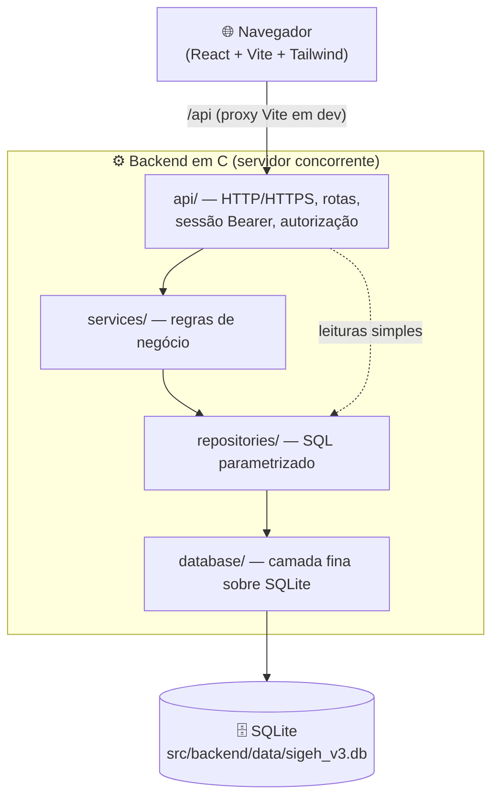

<div align="center">

# 🏗️ Arquitetura do SIGEH-DF

### Documento técnico — como o sistema é organizado e por quê


</div>

---

## 📑 Conteúdo

- [Visão em uma imagem](#-visão-em-uma-imagem)
- [Organização de pastas](#-organização-de-pastas)
- [Camadas do backend](#-camadas-do-backend)
- [Responsabilidades por camada](#-responsabilidades-por-camada)
- [Ciclo de vida de uma requisição](#-ciclo-de-vida-de-uma-requisição)
- [Frontend](#-frontend)
- [Banco de dados e migrações](#-banco-de-dados-e-migrações)
- [Convenções de projeto](#-convenções-de-projeto)
- [Artefatos e distribuição](#-artefatos-e-distribuição)

---

## 🗺️ Visão em uma imagem



> [!NOTE]
> Cada camada **só conhece a camada imediatamente inferior**. A `api/` pode
> chamar um `service` (regra) ou, em leituras simples, um `repository`
> diretamente — mas nunca pula para o SQLite.

---

## 📂 Organização de pastas

```text
Gestao_Saude/
├── src/
│   ├── backend/
│   │   ├── data/                 # schema SQLite, banco local e anexos de runtime
│   │   │   ├── schema_v3.sql     # ⭐ fonte única da verdade do banco
│   │   │   └── sigeh_v3.db       # banco gerado (descartável, fora do git)
│   │   └── web/                  # servidor + módulos C
│   │       ├── api/              # servidor HTTP/HTTPS e roteamento
│   │       ├── services/         # regras de negócio
│   │       ├── repositories/     # 1 arquivo por entidade (só SQL)
│   │       ├── database/         # camada fina sobre SQLite + migrações
│   │       ├── util/             # utilitários transversais (json, senha, ...)
│   │       ├── tools/            # ferramentas (seed do banco)
│   │       ├── tests/            # suítes C + smoke/integração (shell)
│   │       ├── public/           # frontend embutido (gerado, fora do git)
│   │       └── Makefile          # build, run, testes, seed
│   └── frontend/                 # aplicação React/Vite/Tailwind
│       ├── src/
│       │   ├── pages/            # telas por rota
│       │   ├── components/       # componentes reutilizáveis + UI
│       │   ├── api/client.js     # cliente HTTP (token Bearer)
│       │   └── auth/             # contexto de autenticação
│       └── package.json
├── docs/                         # 📚 documentação técnica (este arquivo)
├── imagens/                      # capturas de tela e diagramas
├── executavel/                   # distribuição (binário + frontend buildado)
├── README.md                     # visão geral e referência completa
└── manual.md                     # passo a passo de instalação/execução
```

---

## 🧱 Camadas do backend

```text
┌──────────────────────────────────────────────────────────────────┐
│  api/          Servidor HTTP (sockets POSIX), roteamento,          │
│                sessão por token (Bearer) e autorização por papel.   │
├──────────────────────────────────────────────────────────────────┤
│  services/     Regras de negócio: triagem inteligente, relatórios, │
│                farmácia, anexos, consentimentos e relatório LGPD.   │
├──────────────────────────────────────────────────────────────────┤
│  repositories/ Acesso a dados — 1 arquivo por entidade.            │
│                Apenas SQL com prepared statements. "Burros".       │
├──────────────────────────────────────────────────────────────────┤
│  database/     Camada fina sobre o SQLite: abrir/fechar, executar  │
│                SQL, aplicar migrações e recriar a partir do schema. │
├──────────────────────────────────────────────────────────────────┤
│  🗄️  SQLite  (src/backend/data/sigeh_v3.db)                         │
└──────────────────────────────────────────────────────────────────┘
```

---

## 🧩 Responsabilidades por camada

| Camada | Pasta | Faz | Não faz |
|---|---|---|---|
| **API** | `api/` | Aceita conexões, lê a requisição, autentica (Bearer), aplica a política de acesso por papel, despacha para o handler e serializa JSON. | Regra de negócio complexa; SQL direto. |
| **Services** | `services/` | Regras que cruzam entidades ou exigem validação própria (triagem, relatórios, dispensação, anexos, consentimentos, LGPD). | Falar HTTP; abrir sockets. |
| **Repositories** | `repositories/` | Converte chamadas em SQL parametrizado (`prepare → bind → step → finalize`). Um arquivo por entidade. | Regra de negócio; decisões de acesso. |
| **Database** | `database/` | Encapsula o `sqlite3`: caminho do banco, abertura com `PRAGMA foreign_keys = ON`, execução de scripts, migrações e reset pelo schema. | Conhecer qualquer entidade. |
| **Util** | `util/` | Utilitários transversais sem regra: `repo_json` (montagem/escape de JSON) e `senha_util` (PBKDF2-HMAC-SHA256 + salt via OpenSSL). | Acessar o banco; conhecer rotas. |

> [!TIP]
> Regra de ouro para estender o sistema: **dado novo → repository**;
> **regra que cruza entidades → service**; **rota nova → api/**. Se você
> escreveu SQL dentro de `api/server.c`, provavelmente está no lugar errado.

---

## 🔄 Ciclo de vida de uma requisição

```text
Cliente HTTP
   │  GET /triagens/1/avaliacao   (Authorization: Bearer …)
   ▼
[ api ] aceita a conexão e lê a requisição
   │
   ├─▶ rota pública? (/health, POST /sessao) ─▶ responde direto
   │
   ├─▶ autentica token Bearer ──── falhou ────▶ 401 Unauthorized
   │
   ├─▶ autorizado(método, rota, papel)? ─ não ─▶ 403 Forbidden
   │
   ├─▶ escrita com corpo JSON? ─▶ converte JSON → parâmetros
   │
   ▼
[ handler ] chama um service (regra) ou repository (leitura)
   │
   ▼
[ service/repository ] executa SQL parametrizado no SQLite
   │
   ▼
[ api ] serializa o resultado em JSON e responde (200/201/4xx/5xx)
```

---

## 🎨 Frontend

| Item | Descrição |
|---|---|
| **Stack** | React 19 + Vite + Tailwind CSS. |
| **Roteamento** | `react-router-dom`; telas em `src/pages/`, uma por rota. |
| **Cliente HTTP** | `src/api/client.js` — injeta o token Bearer, trata erros (`ApiError`) e envia escritas como corpo JSON. |
| **Autenticação** | `src/auth/AuthContext.jsx` guarda papel/identidade da sessão. |
| **UI** | Primitivos reutilizáveis em `src/components/ui.jsx` (Card, Badge, Button, Spinner, EmptyState, Alert) e ícones em `icons.jsx`. |
| **Dev** | O proxy do Vite encaminha `/api` para `http://localhost:8080`. |
| **Produção** | `npm run build` gera `dist/`, que pode ser servido pelo próprio servidor C (copiado para `src/backend/web/public`). |

---

## 🗄️ Banco de dados e migrações

- O **schema** em [`src/backend/data/schema_v3.sql`](../src/backend/data/schema_v3.sql) é a **fonte única da verdade**.
- O arquivo `.db` é **descartável**: pode ser recriado a qualquer momento com `make seed` (recria + popula dados de exemplo) ou `make db-reset`.
- **Integridade referencial** é garantida por `FOREIGN KEY` no schema, com `PRAGMA foreign_keys = ON` em toda conexão.
- **Migrações** (`database/migracoes.c`) atualizam bancos antigos por `user_version`, aplicando em ordem apenas as mudanças pendentes — sem perder dados.

> [!IMPORTANT]
> Históricos sensíveis são **append-only / imutáveis**: a trilha de
> **auditoria** nunca é apagada, e a revogação de **consentimentos** não
> apaga o registro — apenas muda o estado para `REVOGADO` e grava data/motivo.

---

## 📐 Convenções de projeto

- ✅ Compila com `-Wall -Wextra -pedantic` **sem warnings**.
- 🔒 **Toda** entrada vai para o SQL via *prepared statements* (nunca concatenação).
- 🧾 Escritas (`POST`/`DELETE`) recebem os dados no **corpo JSON**.
- 🧪 Um teste por entidade/serviço crítico (`tests/test_*.c`) + smoke/integração em shell.
- 🧭 Roteamento por `sscanf("%31s")` para segmentos de rota (sem literal final no `sscanf`).
- ♻️ Texto de UI e documentação em **PT-BR**.

---

## 📦 Artefatos e distribuição

Diretórios e arquivos **gerados** (fora do controle de versão): `build/`, `dist/`,
`public/` (frontend embutido), bancos locais (`*.db`), anexos de runtime e
certificados TLS.

A distribuição é montada em [`executavel/`](../executavel/) copiando o binário
(`make api`) e o frontend (`npm run build`). O passo a passo completo está no
[manual.md](../manual.md#6-gerar-distribuição).

> [!NOTE]
> Não existe um alvo `make release`: a distribuição é feita pelos passos de
> cópia descritos no manual (ou embutindo o frontend com `make frontend`).
